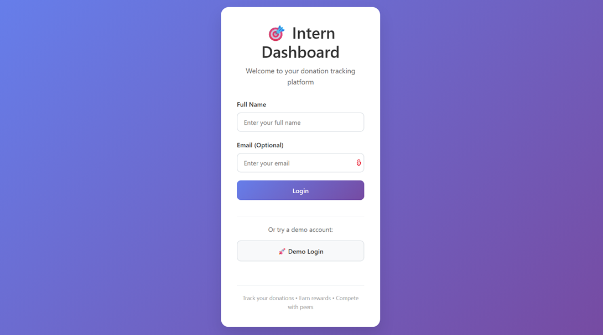
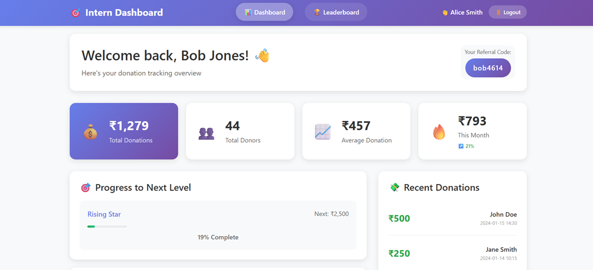
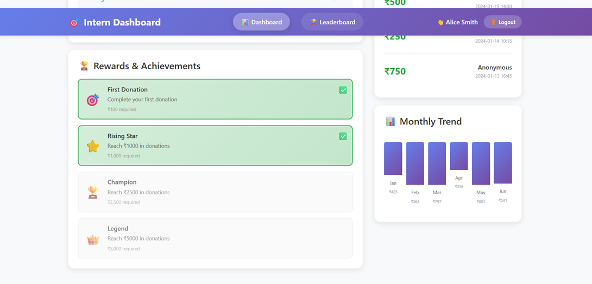
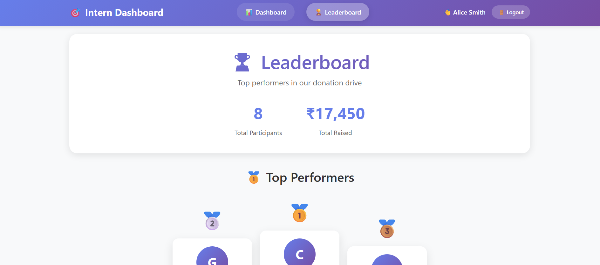
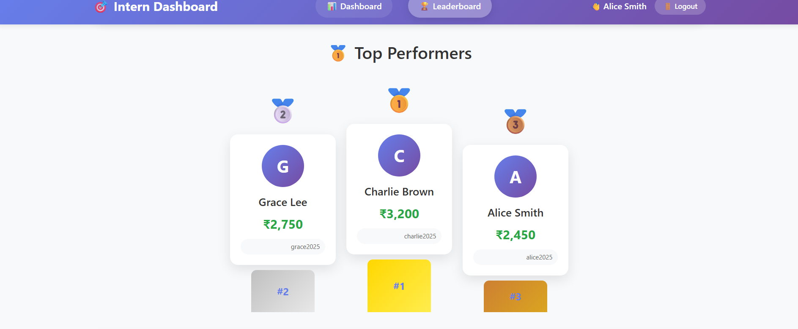
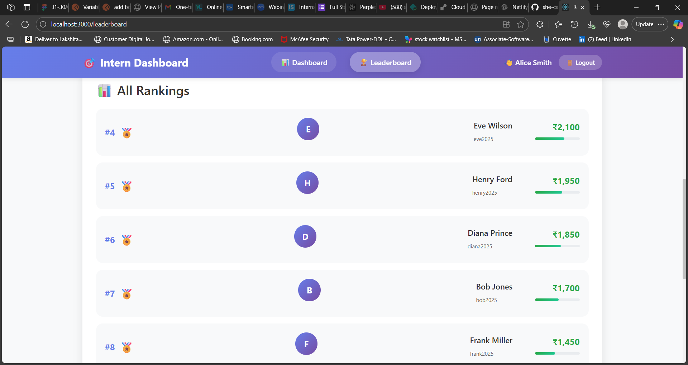
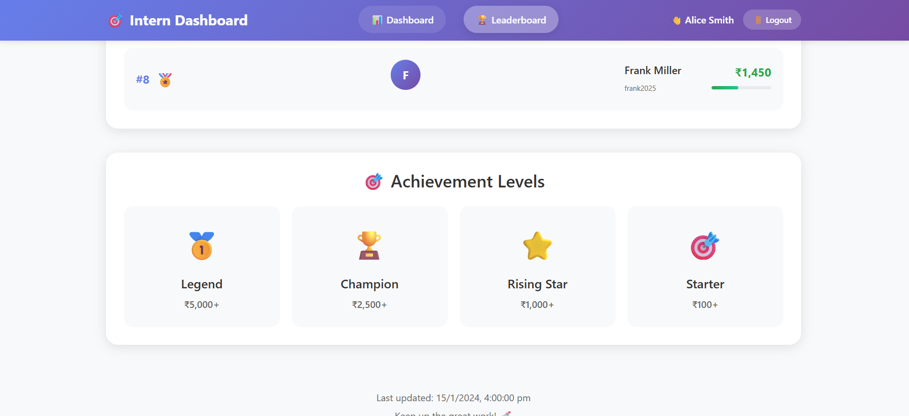

# Intern Dashboard - She Can Foundation

A comprehensive donation tracking dashboard for interns with Django REST API backend and React frontend.

## 🚀 Features

- **User Authentication**: Simple login system for interns
- **Dashboard**: Personal donation tracking with progress visualization
- **Leaderboard**: Competitive ranking system with badges
- **Rewards System**: Achievement-based rewards and milestones
- **Real-time Stats**: Monthly trends and donation analytics
- **Responsive Design**: Mobile-friendly interface
- **Firebase Integration**: Leaderboard data storage (configurable)

## 🛠️ Tech Stack

### Backend
- **Django 4.2.7**: Web framework
- **Django REST Framework**: API development
- **SQLite**: Database (development)
- **Firebase/Firestore**: Optional cloud storage
- **django-cors-headers**: CORS handling

### Frontend
- **React 18**: Frontend framework
- **React Router**: Navigation
- **CSS3**: Styling with gradients and animations
- **Fetch API**: HTTP requests

## 📁 Project Structure

```
intern-dashboard/
├── intern_dashboard/          # Django Backend
│   ├── dashboard/            # Main app
│   │   ├── models.py        # Database models
│   │   ├── views.py         # API endpoints
│   │   ├── urls.py          # URL routing
│   │   └── firebase_config.py # Firebase setup
│   ├── intern_dashboard/    # Project settings
│   └── manage.py           # Django management
├── intern-dashboard-frontend/ # React Frontend
│   ├── src/
│   │   ├── components/      # React components
│   │   │   ├── Login.js     # Login page
│   │   │   ├── Dashboard.js # Main dashboard
│   │   │   ├── Leaderboard.js # Rankings
│   │   │   └── Navigation.js # Navigation bar
│   │   └── App.js          # Main app component
│   └── public/             # Static files
└── README.md              # This file
```

## 🚀 Quick Start

### Prerequisites
- Python 3.8+
- Node.js 14+
- npm or yarn

### Backend Setup

1. **Navigate to backend directory**
   ```bash
   cd intern_dashboard
   ```

2. **Install Python dependencies**
   ```bash
   pip install django djangorestframework django-cors-headers firebase-admin
   ```

3. **Run migrations**
   ```bash
   python manage.py migrate
   ```

4. **Start Django server**
   ```bash
   python manage.py runserver
   ```
   Server will run on `http://localhost:8000`

### Frontend Setup

1. **Navigate to frontend directory**
   ```bash
   cd intern-dashboard-frontend
   ```

2. **Install dependencies**
   ```bash
   npm install
   ```

3. **Start React development server**
   ```bash
   npm start
   ```
   App will open on `http://localhost:3000`

## 📊 API Endpoints

### Base URL: `http://localhost:8000/api/`

| Endpoint | Method | Description |
|----------|--------|-------------|
| `/test/` | GET | API health check |
| `/intern/<id>/dashboard/` | GET | Intern dashboard data |
| `/intern/<id>/stats/` | GET | Intern statistics |
| `/leaderboard/` | GET | Leaderboard rankings |
| `/intern/create/` | POST | Create new intern |

### Example API Response

**Dashboard Data:**
```json
{
  "id": 1,
  "name": "Alice Smith",
  "email": "alice.smith@example.com",
  "referral_code": "alice2025",
  "total_donations": 2450,
  "rewards": [
    {
      "id": 1,
      "title": "First Donation",
      "description": "Complete your first donation",
      "required_donations": 100,
      "icon": "🎯",
      "unlocked": true
    }
  ],
  "recent_donations": [
    {
      "amount": 500,
      "donor_name": "John Doe",
      "date": "2024-01-15 14:30"
    }
  ],
  "progress": {
    "current_level": "Rising Star",
    "next_milestone": 2500,
    "progress_percentage": 65
  }
}
```

## 🎨 UI Components

### Login Page
- Clean, modern design with gradient background
- Demo login functionality
- Form validation

### Dashboard
- Personal stats cards with animations
- Progress tracking with visual indicators
- Rewards system with unlock status
- Recent donations list
- Monthly trend charts

### Leaderboard
- Top 3 podium display
- Complete rankings list
- Achievement level indicators
- Real-time updates

### Navigation
- Responsive navigation bar
- User information display
- Logout functionality

## 🔧 Configuration

### Django Settings
Key settings in `intern_dashboard/settings.py`:

```python
# CORS Configuration
CORS_ALLOW_ALL_ORIGINS = True  # Development only
CORS_ALLOWED_ORIGINS = [
    "http://localhost:3000",
    "http://127.0.0.1:3000",
]

# REST Framework
REST_FRAMEWORK = {
    'DEFAULT_PERMISSION_CLASSES': [
        'rest_framework.permissions.AllowAny',
    ],
}
```

### Firebase Setup (Optional)
1. Create Firebase project
2. Download service account key
3. Update `firebase_config.py` with credentials path
4. Create Firestore collection named `leaderboard`

## 🎯 Features in Detail

### Reward System
- **Beginner**: ₹0+
- **Starter**: ₹100+
- **Rising Star**: ₹1,000+
- **Champion**: ₹2,500+
- **Legend**: ₹5,000+

### Progress Tracking
- Visual progress bars
- Milestone indicators
- Level-based achievements
- Monthly growth tracking

### Responsive Design
- Mobile-first approach
- Flexible grid layouts
- Touch-friendly interfaces
- Cross-browser compatibility

## 🚀 Deployment

### Backend Deployment
1. Set `DEBUG = False` in settings
2. Configure allowed hosts
3. Set up production database
4. Collect static files: `python manage.py collectstatic`

### Frontend Deployment
1. Build production version: `npm run build`
2. Deploy build folder to web server
3. Configure API endpoints for production

## 🤝 Contributing

1. Fork the repository
2. Create feature branch: `git checkout -b feature-name`
3. Commit changes: `git commit -am 'Add feature'`
4. Push to branch: `git push origin feature-name`
5. Submit pull request

## 📝 License

This project is licensed under the MIT License - see the LICENSE file for details.

## 🆘 Troubleshooting

### Common Issues

1. **CORS Errors**
   - Ensure `django-cors-headers` is installed
   - Check CORS settings in Django settings
   - Verify middleware order

2. **API Connection Failed**
   - Check if Django server is running on port 8000
   - Verify API endpoints are accessible
   - Check browser console for errors

3. **React Build Issues**
   - Clear npm cache: `npm cache clean --force`
   - Delete node_modules and reinstall
   - Check Node.js version compatibility

## 📞 Support

For support and questions:
- Create an issue on GitHub
- Contact: [Your Contact Information]

## 🎉 Acknowledgments

- She Can Foundation for the project requirements
- Django and React communities for excellent documentation
- Contributors and testers

---

**Built with ❤️ for She Can Foundation**
screenshots for deployed website...






